# Developer Credibility & Verification Platform

A full-stack MERN platform that helps developers showcase verified projects, validate skills using GitHub-backed evidence, and build credibility scores while enabling recruiters to discover and save trusted developer profiles.

---

## Overview

Developer Credibility & Verification Platform is designed to go beyond traditional portfolio websites by introducing evidence-based verification.

Developers can connect their GitHub work, verify project ownership, showcase verified skills, and build a credibility score backed by real development activity.

Recruiters can browse developer profiles, review verified projects, evaluate credibility metrics, and save promising candidates for future reference.

---

## Key Features

### Authentication & Authorization

* JWT-based Authentication
* Secure Password Hashing using bcryptjs
* Protected Routes
* Role-Based Access Control
* Developer Accounts
* Recruiter Accounts

### Developer Features

* Create and manage professional profiles
* Add skills and project information
* Connect GitHub account
* Showcase verified projects
* Display skill verification evidence
* Public developer profiles
* Credibility scoring system

### Project Verification

* GitHub Repository Ownership Verification
* Automatic Repository Analytics
* Technology Detection from Repository
* Verification Status Tracking

Verification States:

* Verified
* Pending
* Unverified

### Skill Verification

Skills are verified using repository evidence:

* Repository Languages
* package.json Analysis
* Detected Technologies

Example:

* React → Verified
* Node.js → Verified
* JavaScript → Verified
* Python → Not Enough Evidence

### Credibility Score

Each developer receives a credibility score out of 100.

Factors:

* Verified Skills
* Skill Verification Percentage
* Verified Projects
* Profile Completeness

### Recruiter Features

* Browse Developers
* Browse Projects
* View Developer Profiles
* Review Verified Work
* Save Developers
* Manage Saved Developers

---

## Tech Stack

### Frontend

* React
* React Router
* Tailwind CSS
* Axios
* Context API

### Backend

* Node.js
* Express.js
* MongoDB
* Mongoose
* JWT
* bcryptjs

### External APIs

* GitHub REST API

### Database

* MongoDB Atlas

---

## System Architecture

Frontend (React)
↓
REST API
↓
Backend (Node.js + Express)
↓
MongoDB Atlas

↓

GitHub REST API

---

## Core Verification Workflow

Developer Adds Project
↓
GitHub Ownership Verification
↓
Repository Analytics Sync
↓
Technology Detection
↓
Skill Verification
↓
Credibility Score Update

---

## Credibility Score Formula

Total Score: 100

Components:

* Verified Skill Count (0–30)
* Skill Verification Percentage (0–30)
* Verified Projects (0–30)
* Profile Completeness (0–10)

---

# Screenshots

## Home Page

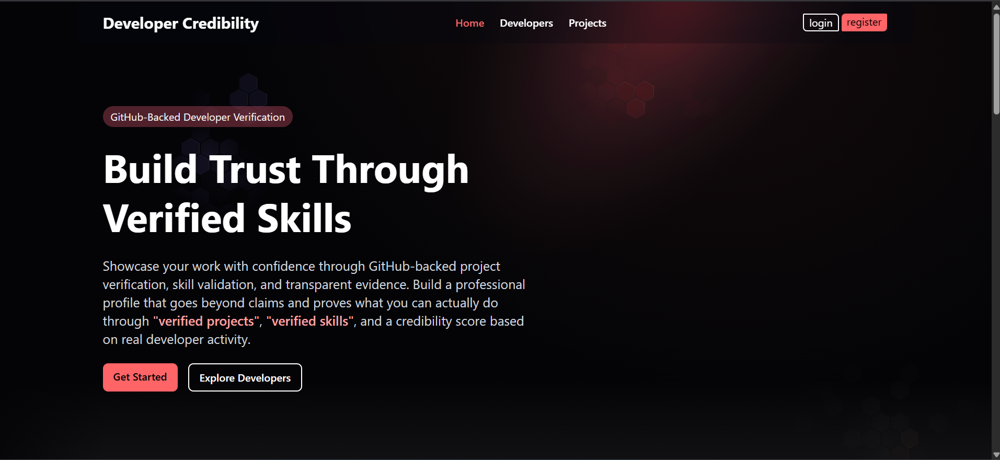

Landing page introducing the platform and its verification-focused approach.

---

## Login & Authentication

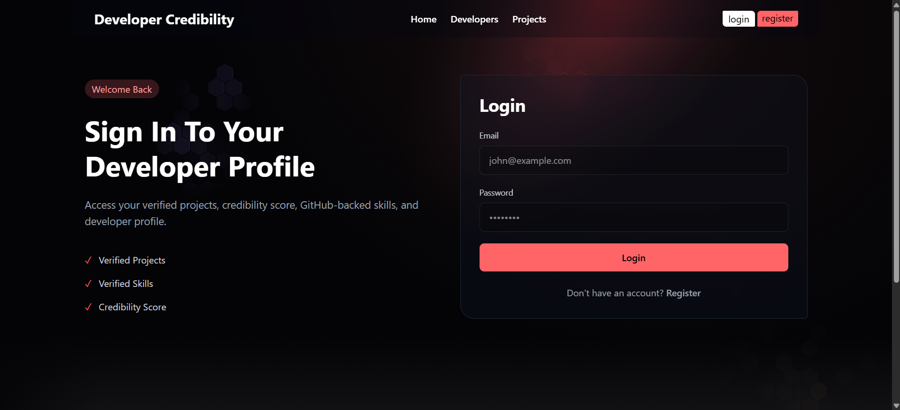

Secure authentication with support for Developer and Recruiter accounts.

---

## Developer Discovery

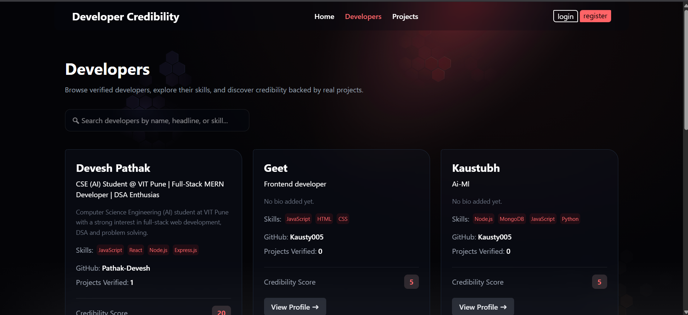

Browse developers using credibility scores, skills, and verified project information.

---

## Developer Profile

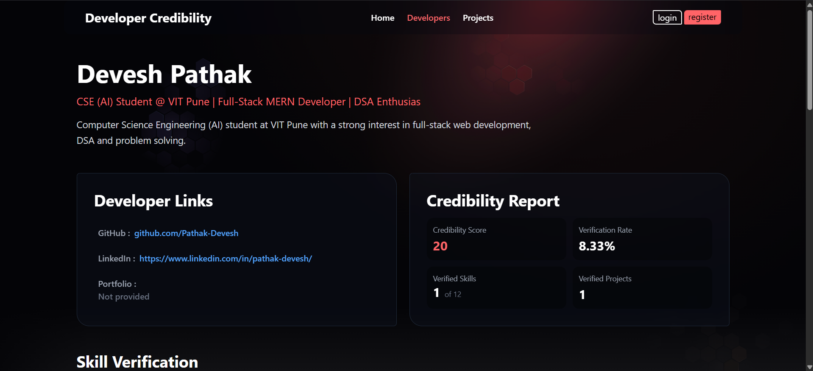

Public developer profile showing:

* Credibility Report
* Verified Skills
* GitHub Overview
* Projects
* Verification Evidence

---

## Projects Discovery

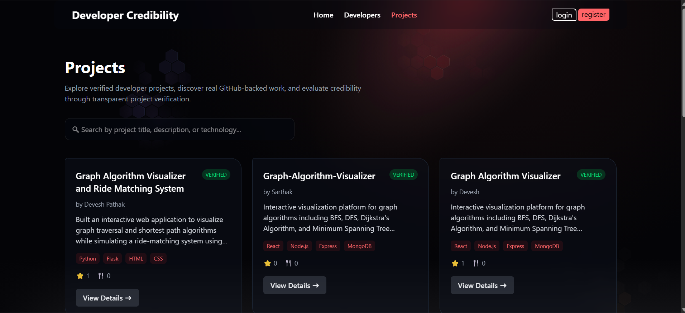

Explore developer projects with verification status and GitHub analytics.

---

## Project Details

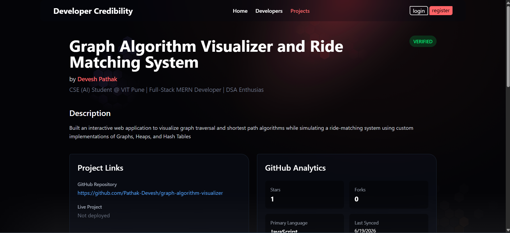

Detailed project view including:

* Description
* Verification Status
* Tech Stack
* GitHub Repository
* Owner Information

---

## Project Verification & Analytics

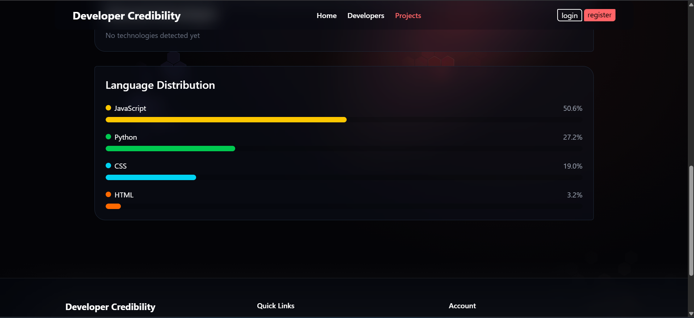

Displays:

* GitHub Analytics
* Language Distribution
* Detected Technologies
* Repository Metrics

---

## Developer Dashboard

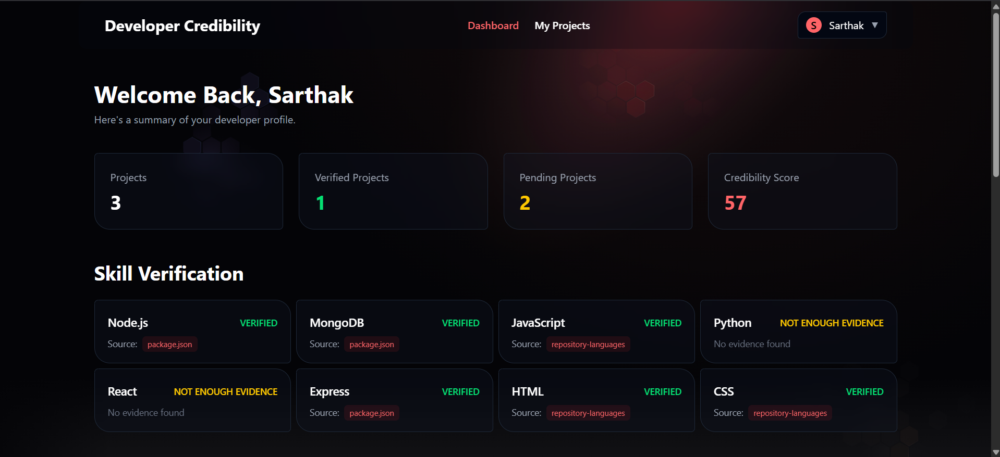

Personal dashboard featuring:

* Project Statistics
* Credibility Score
* Skill Verification Summary
* GitHub Overview
* Recent Projects

---

## Recruiter Dashboard

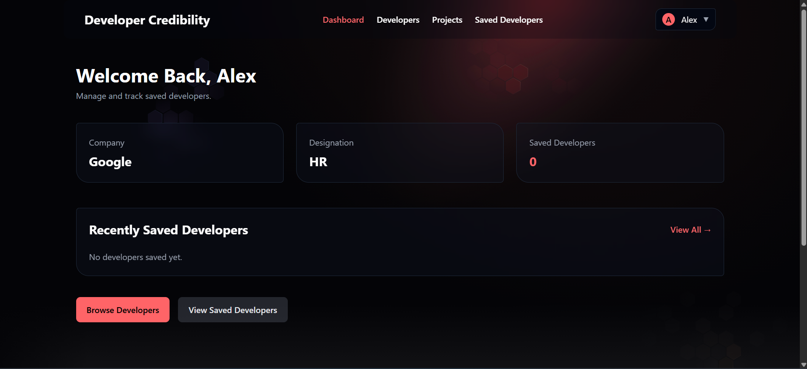

Recruiter-focused dashboard with:

* Company Information
* Saved Developers
* Quick Access Features

---

## Saved Developers

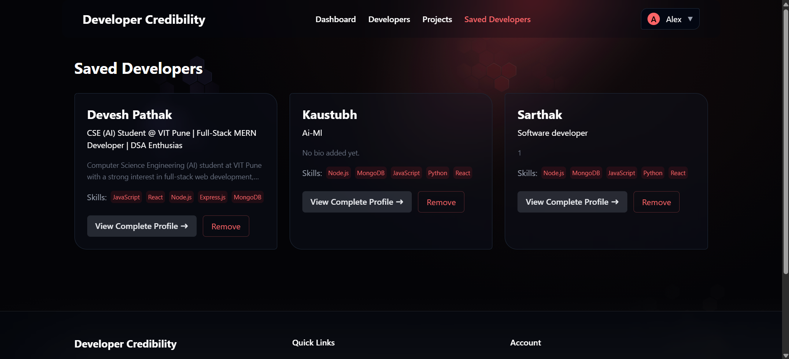

Recruiters can save and manage promising developer profiles.

---

## Profile Management

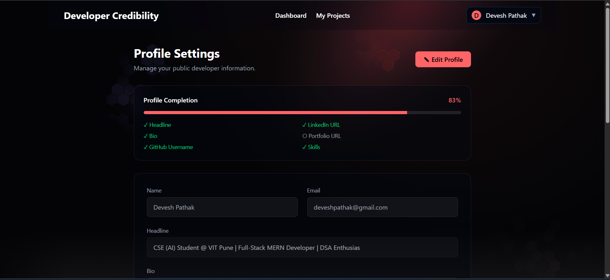

Manage:

* Bio
* Headline
* Skills
* GitHub Username
* LinkedIn
* Portfolio Links

---

# API Overview

## Authentication

POST /api/auth/register

POST /api/auth/login

---

## Users

GET /api/user/profile

PUT /api/user/profile

GET /api/user

GET /api/user/:id

GET /api/user/:id/github

GET /api/user/:id/skills

---

## Projects

POST /api/projects

GET /api/projects

GET /api/projects/:id

PUT /api/projects/:id

DELETE /api/projects/:id

GET /api/projects/my-projects

---

## Dashboard

GET /api/dashboard

---

# Installation

## Clone Repository

git clone <repository-url>

cd developer-credibility-platform

---

## Install Backend Dependencies

npm install

---

## Install Frontend Dependencies

cd client

npm install

---

## Environment Variables

Create a .env file inside the backend directory:

PORT=5000

MONGO_URI=your_mongodb_connection_string

JWT_SECRET=your_jwt_secret

GITHUB_TOKEN=optional_github_token

---

## Run Backend

npm run dev

---

## Run Frontend

cd client

npm run dev

---

## Open Application

http://localhost:5173

---

# Future Improvements

* GitHub Response Caching
* Authenticated GitHub API Requests
* Advanced Developer Search Filters
* Project Recommendation Engine
* Recruiter Notes & Tags
* Email Notifications
* Admin Dashboard
* Analytics Dashboard

---

# Learning Outcomes

This project demonstrates:

* Full-Stack MERN Development
* REST API Design
* Authentication & Authorization
* MongoDB Relationships
* GitHub API Integration
* Role-Based Access Control
* React Architecture
* Context API
* Protected Routes
* Production-Oriented Development Practices

---

# Author

Devesh Pathak

Computer Science Engineering (AI)

Vishwakarma Institute of Technology, Pune

GitHub: https://github.com/Pathak-Devesh

LinkedIn: https://www.linkedin.com/in/pathak-devesh/

---
